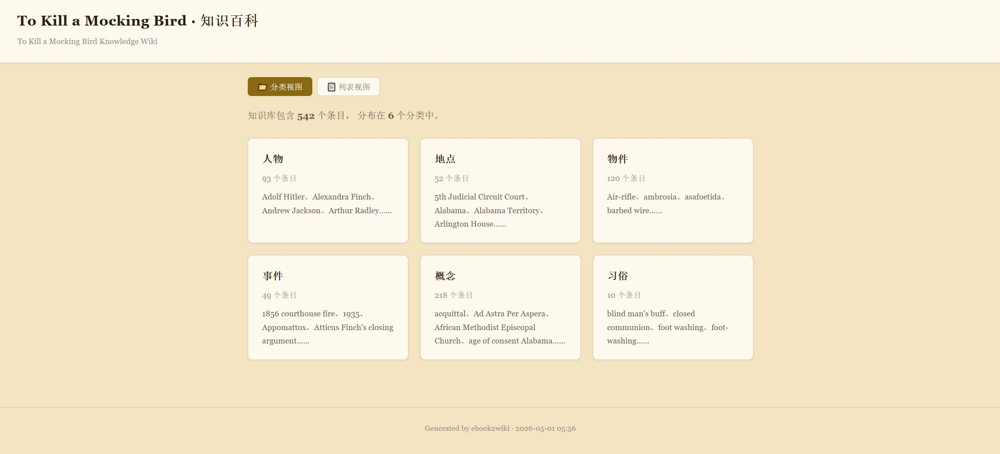
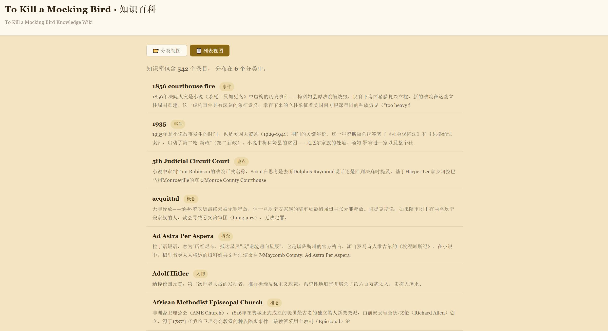
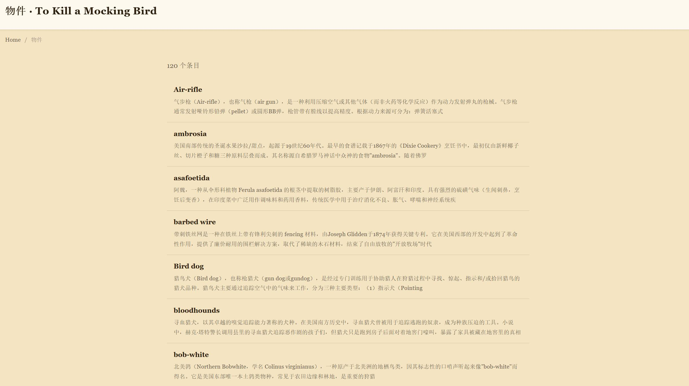
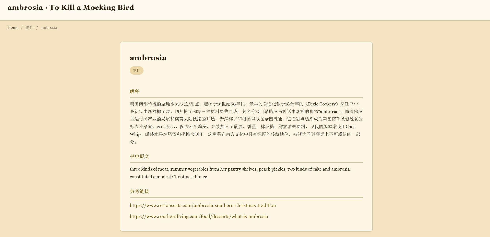
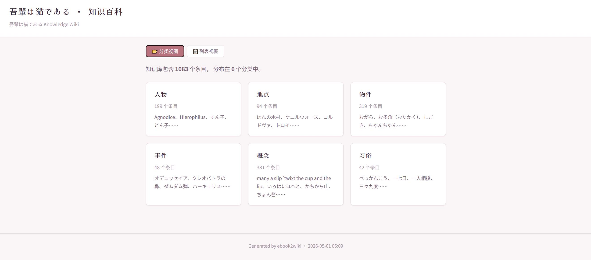
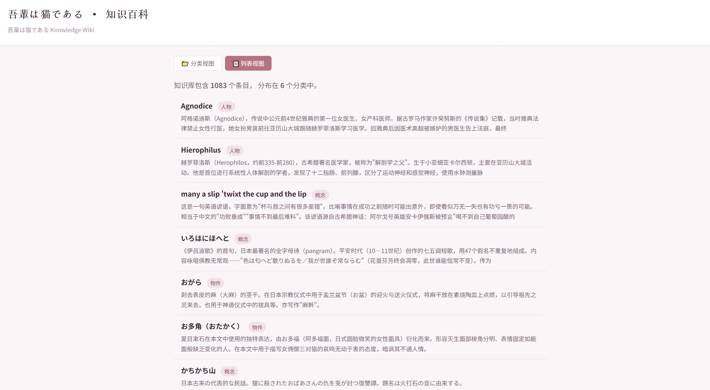
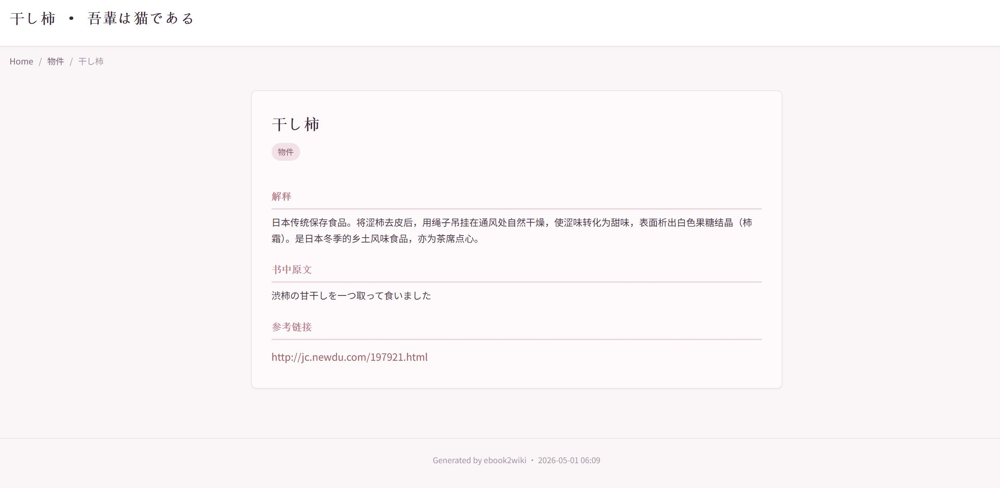

# ebook2wiki

> 从电子书中提取结构化知识，生成带分类导航的静态 Wiki 站点。

适用场景：
1. **量化分析** — 基于 SQLite 数据库对作品中的时代背景、文化习俗、物质生活等维度进行统计与分析。
2. **延伸理解** — 捕捉作者引入特定事物的小巧思、仅靠一目十行的阅读无法体会到的地域特色与象征意味。
3. **语言与文化积累** — 拆解外语作品中的关键实体，系统积累特定文化的概念、习俗和特有表达。
4. **知识 Wiki** — 最终产出美观的静态 HTML Wiki，按分类浏览知识点，无需服务器，浏览器直接打开。

**输入**：电子书文件（PDF / EPUB / MOBI / TXT / MD）

**输出**：静态 Wiki 站点（`_wiki.html` 首页 + `_wiki/` 分类详情页）+ SQLite 知识库（`.db`）

> **快速使用**：`/ebook2wiki "To Kill a Mocking Bird.mobi"`

**Wiki 效果预览：**

| 首页 — 分类卡片 | 首页 — 列表模式 |
|:---:|:---:|
|  |  |
| 分类条目列表 | 条目详情页 |
|  |  |

> 上图：`/ebook2wiki "To Kill a Mocking Bird.mobi"` — 自动选用 parchment（羊皮纸暖黄）主题。

| 首页 — 分类卡片 | 首页 — 列表模式 | 条目详情页 |
|:---:|:---:|:---:|
|  |  |  |

> 上图：`/ebook2wiki "吾輩は猫である.epub"` — 自动选用 sakura（樱花粉白）主题。

> 完整示例（含电子书、数据库、Wiki 产物）见 [assets/examples/](assets/examples/)。

---

## 前置条件

- Python 3.7+
- 依赖（脚本自动安装）：`pdfplumber`、`EbookLib`、`beautifulsoup4`、`PyYAML`
- 可选：`calibre`（MOBI 格式）、`mobi` Python 包

---

## 功能特点

- **多格式支持** — PDF、EPUB、MOBI、TXT、Markdown
- **分块处理** — 约 5000 字符的重叠文本块，避免上下文溢出
- **互联网验证** — 每个条目通过网络搜索交叉验证
- **5 字段结构** — 名词（原文用词）、分类、解释、书中原文、网络来源
- **六大分类** — 人物、地点、物件、事件、概念、习俗
- **6 套主题** — 水墨、羊皮纸、天空、森林、暗色、樱花，自动匹配内容基调
- **可中断恢复** — 断点检测，随时中断和续传

---

## 主题方案

| 主题 | 风格 | 适用 |
|------|------|------|
| `ink` | 水墨黑白 | 古典文学、历史、哲学 |
| `parchment` | 羊皮纸暖黄 | 奇幻、历史小说、探险 |
| `sky` | 天空浅蓝 | 科幻、科技 |
| `forest` | 森林绿意 | 自然散文、游记 |
| `obsidian` | 暗色深邃 | 悬疑推理、哥特 |
| `sakura` | 樱花粉白 | 日本文学、俳句 |

