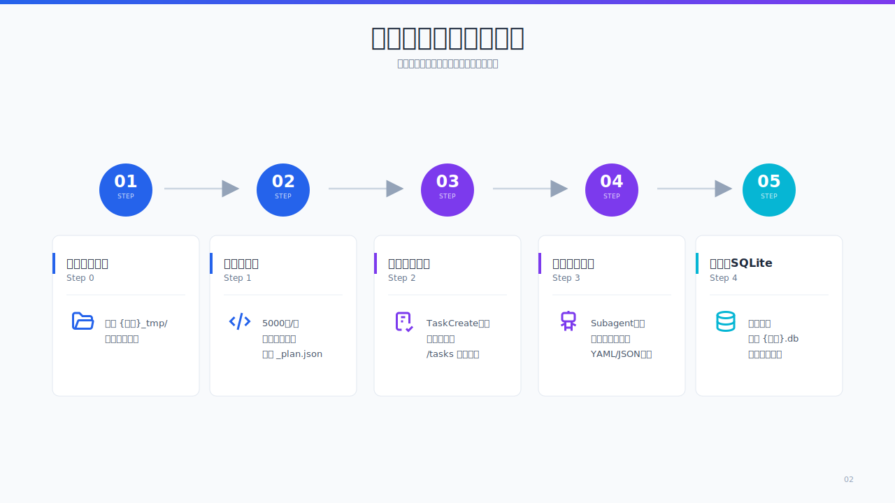
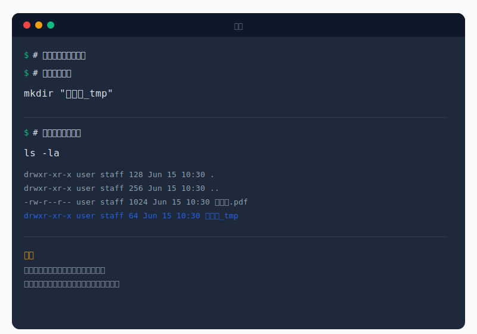
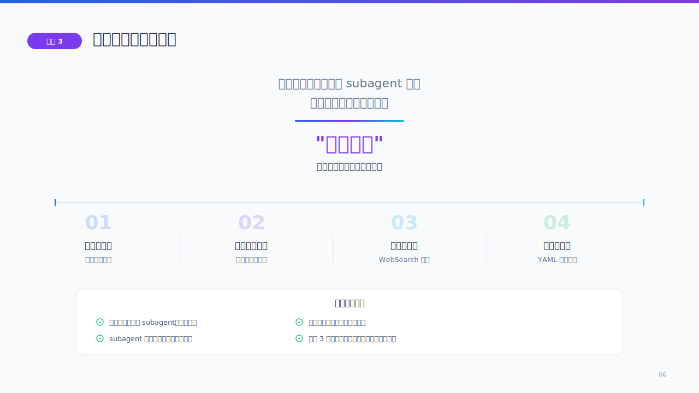
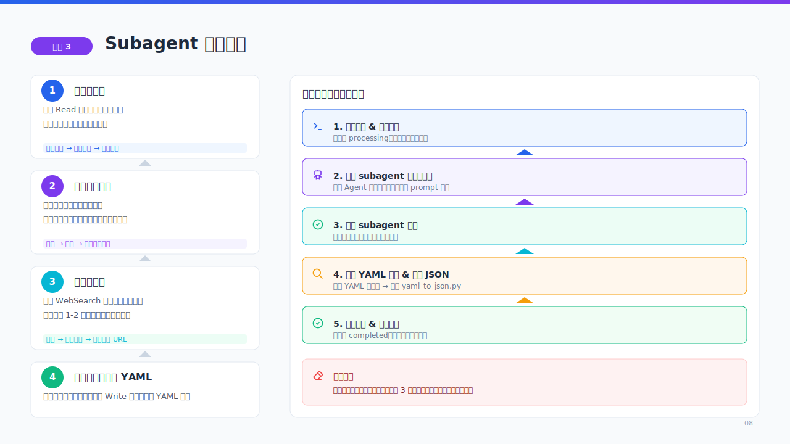
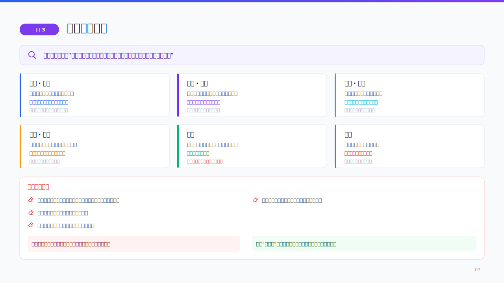
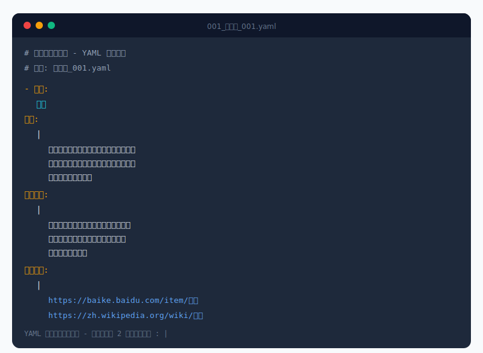
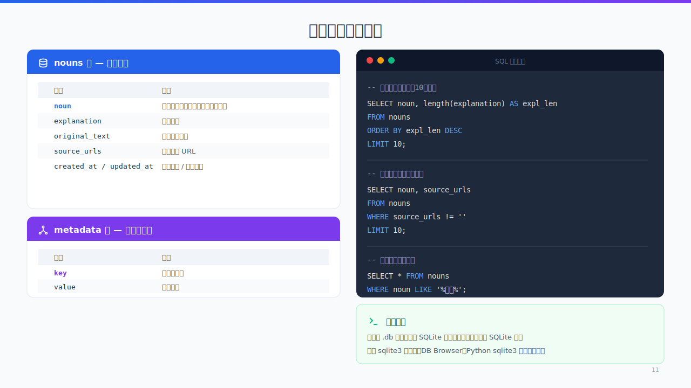
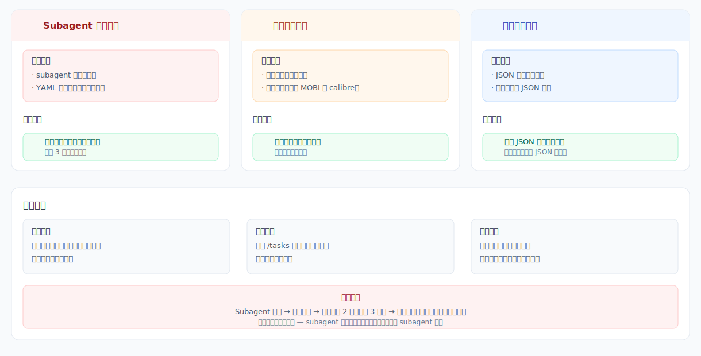
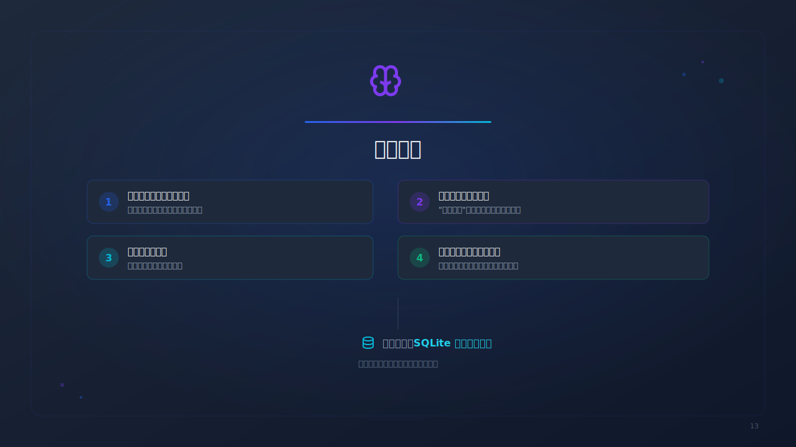

# Ebook Knowledge Extractor

> 从电子书（PDF/EPUB/MOBI/TXT/MD）中提取结构化知识，存入可查询的 SQLite 数据库。

**快速使用：** `/ebook-knowledge-extractor 电子书路径/书名.epub`

> 本文档中的示意图使用 [/ppt-master](https://github.com/hugohe3/ppt-master) 制作。

专为希望*系统化地*从书中捕获文化、历史和领域知识的读者而设计——不只是标注句子，而是构建一个经过互联网验证的结构化知识库。

## 概述



整个流水线将原始电子书内容转换为一个去重、可搜索的知识库，分为五个串行步骤：

1. 创建工作目录
2. 将电子书切分为重叠的文本段
3. 创建任务追踪列表
4. 通过 AI subagent 串行提取知识条目
5. 合并到 SQLite 数据库

---

## 功能特点

- **多格式支持** — PDF、EPUB、MOBI、TXT、Markdown
- **分块处理** — 从不一次性读取整本书；拆分为约 5000 字符的重叠文本块，避免上下文溢出
- **串行提取** — 每次由一个 AI subagent 处理一个文本块，质量优先于速度
- **互联网验证** — 每个提取的条目都通过网络搜索交叉验证，确保解释准确
- **去重输出** — 自动将重复条目（不区分大小写）合并到同一个 SQLite 数据库
- **可中断恢复** — 基于任务链的设计，允许在任何时候中断和恢复

---

## 前置条件

### Python

- Python 3.7+

### Python 包

脚本在首次运行时会自动安装缺失的依赖，但你也可以预先安装：

```
pip install pdfplumber EbookLib beautifulsoup4 PyYAML
```

| 包 | 被谁使用 | 用途 |
|---------|-------------|--------|
| `pdfplumber` | `chunk_ebook.py` | 从 PDF 文件中提取文本 |
| `EbookLib` | `chunk_ebook.py` | 解析 EPUB 格式 |
| `beautifulsoup4` | `chunk_ebook.py` | 从 EPUB 中提取 HTML 内容 |
| `PyYAML` | `yaml_to_json.py` | 解析 subagent 输出的 YAML |

### 可选依赖

| 包 / 工具 | 用途 | 安装方式 |
|----------------|------------|---------|
| `mobi` (Python) | MOBI 格式提取 | `pip install mobi` |
| [calibre](https://calibre-ebook.com) (`ebook-convert`) | MOBI 格式提取（备选） | 系统安装 calibre |

> **关于 MOBI 格式的说明**：`chunk_ebook.py` 首先尝试使用 `calibre` 的 `ebook-convert` 命令行工具，然后回退到 `mobi` Python 包。如果两者都不可用，会报告错误并给出清晰的安装指引。

### 脚本文件

三个脚本位于 `scripts/` 目录：

| 脚本 | 用途 |
|--------|---------|
| `chunk_ebook.py` | 将电子书拆分为重叠文本块 + 生成 `_plan.json` |
| `yaml_to_json.py` | 将 subagent 输出的 YAML 转换为标准 JSON |
| `merge_to_sqlite.py` | 将所有 JSON 记录合并到去重的 SQLite 数据库 |

---

## 工作流程（详细说明）

### 第 0 步：创建工作目录

```bash
mkdir "{book_name}_tmp"
```

所有中间文件（文本块、YAML、JSON、计划文件）都存放在此目录中。



### 第 1 步：切分电子书

```bash
python scripts/chunk_ebook.py <ebook_path> --chunk-size 5000
```

该脚本会：

1. 检测文件格式并提取全文
2. 自动安装缺失的 Python 依赖
3. 将文本拆分为约 5000 字符的文本块，块间约 100 字符重叠
4. 保存为 `{book_name}_001.txt`、`{book_name}_002.txt`……
5. 生成 `_plan.json`——包含每个文本块元数据的处理计划



### 第 2 步：创建任务列表

读取 `_plan.json`，为每个文本块创建一个 `TaskCreate` 任务，通过 `addBlockedBy` 串联成依赖链：

- 任务 2 → 依赖于任务 1
- 任务 3 → 依赖于任务 2
- ……

这样，你可以随时通过 `/tasks` 查看处理进度。


### 第 3 步：串行提取知识

这是核心步骤。每个文本块由一个 AI subagent 处理（严格串行，一次一个）：



每个文本块的处理流程：

1. **读取**文本块内容
2. **识别**其中的知识型条目（而非普通名词）
3. **网络搜索**每个条目进行验证
4. **撰写**结合书中上下文和网络来源的解释
5. **输出**为 YAML 文件

#### 知识条目筛选标准

只提取那些不熟悉该主题的读者需要查资料才能理解的内容：



**六大类别**：

- 物件与工艺 — 具有文化意义的手工制品、手工艺品、食物
- 习俗与仪式 — 节日、典礼、禁忌
- 概念与信仰 — 独特的哲学观念、民间智慧
- 事件与典故 — 历史事件、传说
- 人物 — 仅限真实历史人物或文化象征
- 地点 — 具有历史/文化意义的重要场所

**明确排除**：普通角色名、日常物品、通用动作/状态。

#### 串行约束

> **严格串行，禁止并行。** 一次只能处理一个 subagent。等待前一个完成后再启动下一个。
>
> "慢就是快"——质量优先于速度。每个 subagent 处理一个文本块可能需要几分钟（读取 → 识别 → 搜索 → 写入）。每完成一个文本块后汇报进度。

#### YAML 输出格式

Subagent 输出使用 YAML 而非 JSON，因为 YAML 的多行文本无需引号转义，书中对话中的双引号不会破坏格式。每个条目包含四个字段：**名词**、**解释**、**书中原文**、**网络来源**。



Subagent 输出 YAML 后，通过 `yaml_to_json.py` 自动转换为标准 JSON，确保格式绝对正确。

### 第 4 步：合并到 SQLite

```bash
python scripts/merge_to_sqlite.py {book_name}_tmp
```

该脚本会：

1. 扫描目录下所有 `*.json` 文件
2. 按名词（不区分大小写）去重
3. 合并解释、原文和来源 URL
4. 写入 `{book_name}.db`



#### 数据库表结构

**`nouns` 表**——知识条目：

| 列名 | 说明 |
|--------|-------------|
| `noun` | 条目名称（主键，不区分大小写） |
| `explanation` | 综合解释 |
| `original_text` | 书中原文 |
| `source_urls` | 网络来源 URL |
| `created_at` | 创建时间戳 |
| `updated_at` | 更新时间戳 |

**`metadata` 表**——处理元信息（`key`/`value` 键值对）。

**查询示例：**

```sql
-- 解释最长的前 10 个条目
SELECT noun, length(explanation) AS expl_len
FROM nouns ORDER BY expl_len DESC LIMIT 10;

-- 包含网络来源的条目
SELECT noun, source_urls
FROM nouns WHERE source_urls != '' LIMIT 10;

-- 关键词搜索
SELECT * FROM nouns WHERE noun LIKE '%batik%';
```

---

## 输出

最终产出是 `{book_name}.db`——一个标准 SQLite 文件，可使用任何 SQLite 客户端（`sqlite3`、DB Browser、Python `sqlite3` 模块等）查询。

示例统计输出：

```
📊 处理完成
────────────────────────────────
总计文本块:    42
原始条目:    587
去重后:      423
数据库文件:  红楼梦.db
────────────────────────────────
```

---

## 错误处理

| 失败场景 | 处理策略 |
|---------|----------|
| Subagent 超时/错误 | 重试该文本块（最多重试 2 次，累计 3 次尝试）。连续 3 次失败后跳过，在最终报告中注明 |
| 切分脚本失败 | 检查格式是否支持。对于不支持的格式（如无 calibre 的 MOBI），提示用户转换格式 |
| 合并脚本失败 | 检查 JSON 文件完整性。手动修复损坏的 JSON 后重试 |



---

## 核心原则



1. **绝不直接读取整本电子书** — 分块处理是硬性要求，防止上下文溢出
2. **串行处理** — 质量优先于速度，一次处理一个文本块
3. **知识型条目优先** — 只提取读者需要查资料才能理解的内容
4. **互联网验证** — 绝不凭空编造；始终结合书中原文和网络搜索结果
5. **结构化输出** — 去重的 SQLite 数据库，便于查询和复用

---

## 许可证

本项目属于 Claude Code skill 生态系统的一部分。
